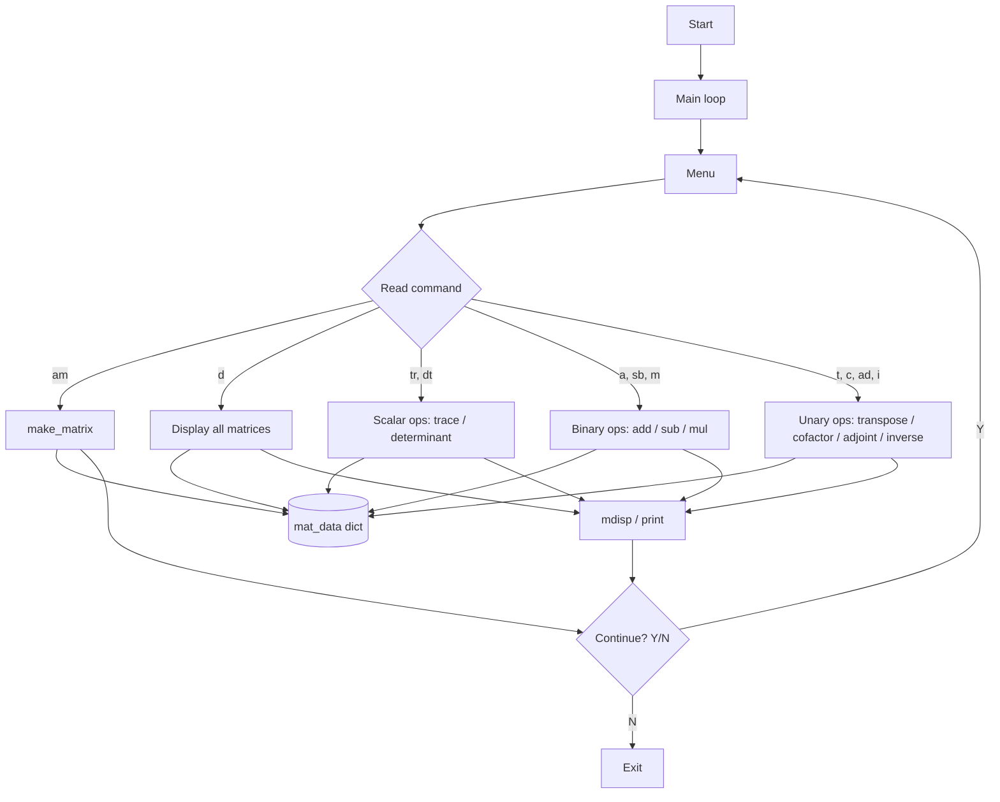
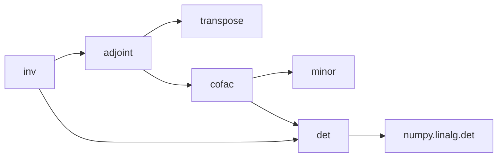
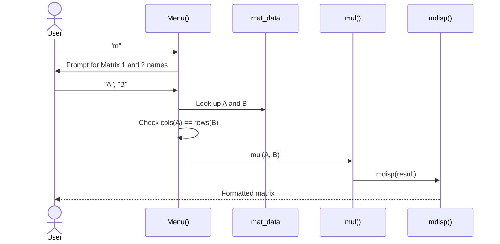

# Architecture: Matrix Calculator

A menu-driven, command-line matrix calculator written in Python. Users create named matrices, store them in memory for the session, and run operations on them (arithmetic, trace, determinant, transpose, cofactor, adjoint, inverse).

- **Language:** Python 3.6+ (uses f-strings)
- **Dependency:** [NumPy](https://numpy.org/) (used only for `np.linalg.det`)
- **Entry point:** `Matrix Calculator.py` (single-file script)
- **Interface:** Interactive terminal (stdin/stdout)

---

## 1. High-Level Overview

The program is a single script organised into four logical layers:

| Layer | Responsibility | Key symbols |
|-------|----------------|-------------|
| **Utilities** | Matrix creation and pretty-printing | `list2d`, `mdisp`, `matsqchk` |
| **Math core** | Pure matrix operations | `add`, `sub`, `mul`, `trace`, `det`, `minor`, `cofac`, `transpose`, `adjoint`, `inv` |
| **State & input** | In-memory storage and matrix entry | `mat_data`, `make_matrix` |
| **UI / control** | Menu, dispatch and main loop | `Menu`, `contnue` loop |



---

## 2. Data Model

### Matrix representation
A matrix is a plain **2D Python list** (list of rows) of integers:

```python
[[1, 2],
 [3, 4]]
```

`list2d(r, c)` builds an `r x c` zero-filled matrix and is the standard way new matrices are allocated throughout the code.

### Storage
All matrices live in a module-level dictionary for the lifetime of the process:

```python
mat_data = { "A": [[...]], "B": [[...]] }   # name -> 2D list
```

- Keys are user-supplied matrix names (case-sensitive).
- Entering an existing name overwrites the previous matrix.
- Nothing is persisted to disk; data is lost when the program exits.

---

## 3. Component Details

### 3.1 Utilities

| Function | Description |
|----------|-------------|
| `list2d(r, c)` | Lambda returning an `r x c` matrix filled with `0`. |
| `mdisp(m, name="Output", msg="")` | Formats and prints a matrix inside a decorative border, one row per line, tab-separated. |
| `matsqchk(m)` | Returns `True` if the matrix is square (`rows == columns`). |

### 3.2 Math Core

| Function | Algorithm | Returns / Output |
|----------|-----------|------------------|
| `add(a, b)` | Element-wise sum | Prints result via `mdisp` |
| `sub(a, b)` | Element-wise difference | Prints result via `mdisp` |
| `mul(a, b)` | Triple-loop matrix product, O(r1·c2·r2) | Prints result via `mdisp` |
| `trace(a)` | Sum of the main diagonal | Number |
| `det(a)` | Delegates to `numpy.linalg.det` | Float |
| `minor(a, x, y)` | Copy of `a` with row `x` and column `y` removed (1-indexed) | 2D list |
| `cofac(a)` | For each cell: `(-1)^(i+j) * det(minor)`, rounded to 2 decimals | 2D list |
| `transpose(a)` | Swap rows and columns | 2D list |
| `adjoint(a)` | `transpose(cofac(a))` | 2D list |
| `inv(a)` | `adjoint(a) / det(a)`, rounded to 2 decimals | 2D list |

**Dependency chain for the inverse:**



> **Note:** `add`, `sub` and `mul` print their result directly, while the other operations return a value that the menu then displays. See [Known Limitations](#6-known-limitations--improvement-ideas).

### 3.3 Input Handling

`make_matrix()` interactively:
1. Asks for a matrix **name**.
2. Asks for **rows** and **columns**.
3. Prompts for each element as `Enter i,j :` (1-indexed) and converts it with `int()`.
4. Stores the result in `mat_data[name]` and echoes it back with `mdisp`.

### 3.4 Menu & Control Flow

`Menu()` prints the available commands, reads one command string, and dispatches through an `if / elif` chain:

| Command | Action | Preconditions checked |
|---------|--------|-----------------------|
| `am` | Add a new matrix | none |
| `d` | Display all stored matrices | reports if store is empty |
| `tr` | Trace | matrix must be square |
| `dt` | Determinant | matrix must be square |
| `a` | Add two matrices | identical dimensions |
| `sb` | Subtract two matrices | identical dimensions |
| `m` | Multiply two matrices | `cols(A) == rows(B)` |
| `t` | Transpose | none |
| `c` | Cofactor matrix | wrapped in `try/except` |
| `ad` | Adjoint | wrapped in `try/except` |
| `i` | Inverse | wrapped in `try/except` |

The **main loop** at the bottom of the file calls `Menu()` repeatedly and asks `Want to Continue (Y/N)?`. Entering `n`/`N` ends the program; any other input continues.

### 3.5 Sequence: multiplying two matrices



---

## 4. Error Handling Strategy

| Situation | Behaviour |
|-----------|-----------|
| Dimension mismatch (add/sub/mul) | Friendly message, no computation |
| Non-square matrix for trace | Friendly message |
| Any exception inside add/sub/mul/c/ad/i | Caught by a bare `except`, prints `Something Went Wrong !!` |
| Unknown command | Silently ignored; menu is shown again after the continue prompt |

---

## 5. Running the Project

```bash
pip install numpy
python "Matrix Calculator.py"
```

Example session:

```
Enter task : am
Give Matrix Name : A
Enter number of rows : 2
Enter number of columns : 2
Enter 1,1 :1
Enter 1,2 :2
Enter 2,1 :3
Enter 2,2 :4
...
Enter task : i
Enter Matrix Name : A
```

---

## 6. Known Limitations & Improvement Ideas

Documenting these here makes good starting points for contributors.

**Correctness / robustness**
- `tr`, `dt`, `t` do not wrap the matrix lookup in `try/except`, so an unknown matrix name raises a `KeyError` and crashes the program.
- `dt` prints nothing when the matrix is not square (no `else` branch).
- `inv` does not check for a singular matrix (`det == 0`); this yields `inf`/`nan` values instead of a clear error message. Cofactor, adjoint and inverse also do not check that the matrix is square.
- A `1x1` matrix breaks `minor`/`cofac`, because the minor is empty.
- Input uses `int()`, so decimal entries and invalid input (e.g. letters) raise a `ValueError`. Row/column counts are not validated to be positive.
- Bare `except:` clauses hide the real cause of errors; catch specific exceptions instead.
- Cofactor and inverse values are rounded to 2 decimals, and `np.linalg.det` returns floating-point results, so small precision errors are possible.

**Design**
- `add`, `sub`, `mul` print instead of returning results, unlike the other operations. Returning values and letting the UI layer print would make the math core reusable and testable.
- The `if / elif` dispatch chain could be replaced by a dictionary mapping commands to handler functions.
- The script runs immediately on import; wrap the entry point in `if __name__ == "__main__":`.
- `mat_data` is a global; a small `MatrixStore` class would encapsulate state.

**Features**
- Scalar multiplication, matrix powers, rank, and row-reduction (RREF).
- Persisting matrices to JSON/CSV.
- Unit tests (e.g. with `pytest`) for the math core.

### Suggested target structure

```
matrix-calculator/
├── matrix_calculator/
│   ├── __init__.py
│   ├── operations.py   # pure math functions
│   ├── display.py      # mdisp and formatting
│   ├── storage.py      # mat_data / MatrixStore
│   └── cli.py          # Menu and main loop
├── tests/
│   └── test_operations.py
├── ARCHITECTURE.md
├── README.md
└── requirements.txt
```
